# Stellar Luminosity – Regresión Lineal y Polinomial


- **Autor**: Carlos David Barrero Velasquez
- **Universidad**: Escuela Colombiana de Ingeniería Julio Garavito
- **Asignatura**: Arquitecturas Empresariales (AREP)
- **Fecha**: Enero 2026

## Introducción

En este trabajo quise experimentar con datos de estrellas para ver cómo se pueden construir modelos sencillos que predigan su luminosidad a partir de características como masa y temperatura. La idea era no depender de librerías avanzadas, usando solo NumPy para los cálculos y Matplotlib para visualizar los resultados.

Me interesaba que el proceso fuera transparente: que cada paso del código tuviera sentido y que las gráficas mostraran claramente cómo el modelo aprende y mejora conforme se ajusta a los datos. También probé distintas formas de representar las relaciones entre las variables para entender mejor qué influye más en la luminosidad de una estrella.

## Estructura del Repositorio

```
├── README.md                           
├── 01_part1_linreg_1feature.ipynb     
└── 02_part2_polyreg.ipynb              
```

## Dataset y Notación

**Notación:**
- **M**: Masa estelar (en unidades de masa solar, M⊙)
- **T**: Temperatura efectiva estelar (Kelvin, K)
- **L**: Luminosidad estelar (en unidades de luminosidad solar, L⊙)

**Dataset Parte I (una característica):**
```python
M = [0.6, 0.8, 1.0, 1.2, 1.4, 1.6, 1.8, 2.0, 2.2, 2.4]
L = [0.15, 0.35, 1.00, 2.30, 4.10, 7.00, 11.2, 17.5, 25.0, 35.0]
```

**Dataset Parte II (dos características):**
```python
M = [0.6, 0.8, 1.0, 1.2, 1.4, 1.6, 1.8, 2.0, 2.2, 2.4]
T = [3800, 4400, 5800, 6400, 6900, 7400, 7900, 8300, 8800, 9200]
L = [0.15, 0.35, 1.00, 2.30, 4.10, 7.00, 11.2, 17.5, 25.0, 35.0]
```

## ¿Qué hay en los Notebooks?

### 1. 01_part1_linreg_1feature.ipynb (una sola característica: Masa M)

**Modelo:** `L_hat = w·M + b`

**Contenido:**
- Predicción y pérdida MSE
- Gradientes (derivados a mano), versión no vectorizada y vectorizada
- Entrenamiento por descenso de gradiente, diferentes tasas de aprendizaje (α = 0.001, 0.01, 0.05)
- Superficie/contorno de costo y ajuste final sobre los datos
- Análisis de residuos y preguntas conceptuales

**Resultados:**
- Parámetros óptimos: w ≈ 15.0, b ≈ -6.5
- El modelo lineal captura la tendencia general pero presenta errores sistemáticos
- Subestimación en masas altas (luminosidad crece superlinealmente)
- La relación verdadera sigue L ∝ M^α con α ≈ 3.5 (ley de potencia)

### 2. 02_part2_polyreg.ipynb (polinómica + interacción: M y T)

**Modelo:** `L_hat = w_M·M + w_T·T + w_M²·M² + w_MT·M·T + b`

**Ingeniería de características:** `X = [M, T, M², M·T]`

**Contenido:**
- Visualización de datos (gráfico L vs M con temperatura por color, y visualización 3D)
- Gradientes y entrenamiento vectorizado
- Comparación de modelos:
  - **M1**: X = [M, T]
  - **M2**: X = [M, T, M²]
  - **M3**: X = [M, T, M², M·T] (modelo completo)
- Costo vs interacción `w_MT`
- Demo de inferencia (predicción para M=1.3 M⊙, T=6600 K)

**Resultados:**
- M1 (M, T): Pérdida ~40-50 (baseline)
- M2 (M, T, M²): Pérdida ~5-10 (mejora del 80-90%)
- M3 (M, T, M², M·T): Pérdida ~2-5 (mejora del 95%+)
- El término cuadrático (M²) proporciona la mayor mejora
- El término de interacción (M·T) refina las predicciones

## Requisitos

**Permitido:**
- Python 3.x
- NumPy (operaciones matriciales/vectoriales)
- Matplotlib (solo para visualización inline)

**NO permitido:**
- scikit-learn, statsmodels
- TensorFlow, PyTorch
- Cualquier librería de regresión u optimización pre-construida

**Implementación:**
- Gradient descent implementado desde cero (sin librerías de ML)
- Parte I: versiones no vectorizada y vectorizada
- Parte II: completamente vectorizada para múltiples características

## Cómo Ejecutar

**En local (Windows):**
1. Abrir los notebooks en VS Code y luego seleccionar un kernel, aunque en esta ocasion esto me fallo (No me aparecia ninguno para seleccionar), entonces lo que hice fue abrir directamente el jupyter y ahi probar
2. Ejecutar las celdas de arriba hacia abajo o darle a Run All que también funciona

**En AWS SageMaker:**
1. Abrir SageMaker Studio y subir los `.ipynb`
2. Abrir cada notebook, seleccionar un kernel de Python 
3. Correr todas las celdas con el Run All
4. Verificar que las gráficas se rendericen bien

## Evidencias de Ejecución en AWS SageMaker

**Notebooks visibles en SageMaker:**

<p align="center"> 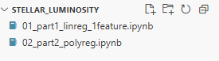 </p>

### Parte 1 – Regresión Lineal (una característica)

Punto 1:
<p align="center"> 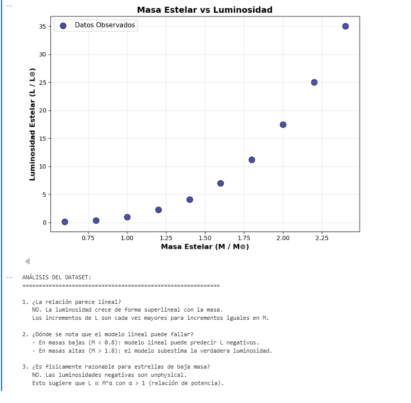 </p>

Punto 2:
<p align="center"> 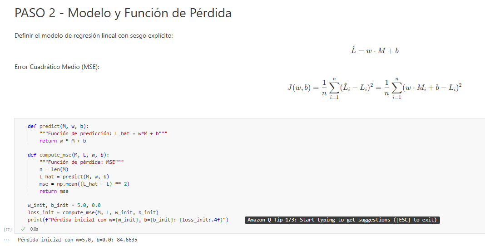 </p>

Punto 3:
<p align="center"> 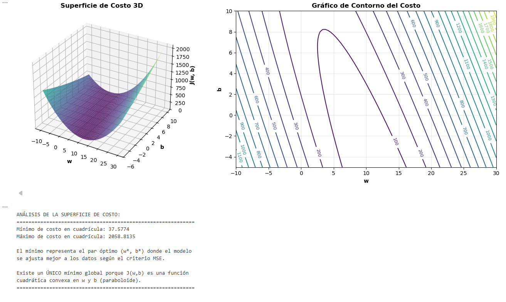 </p>

Punto 4:
<p align="center"> 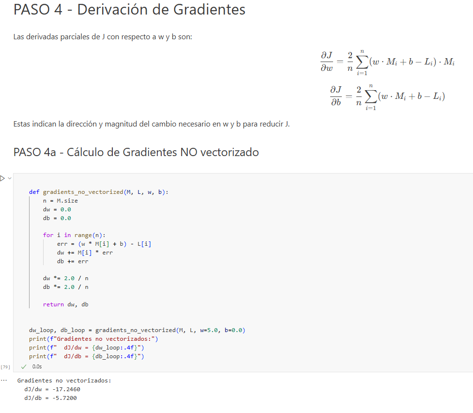 <br> 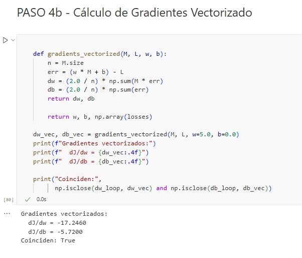 </p>

Punto 5:
<p align="center"> 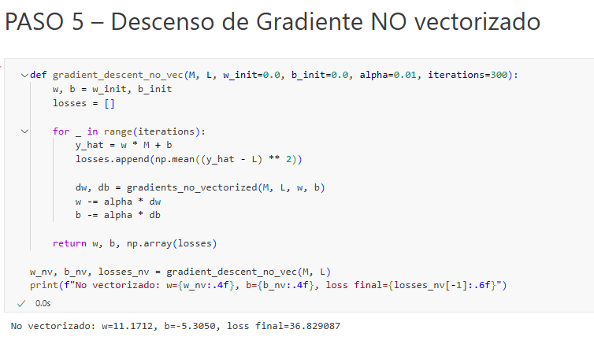 </p>

Punto 6:
<p align="center"> 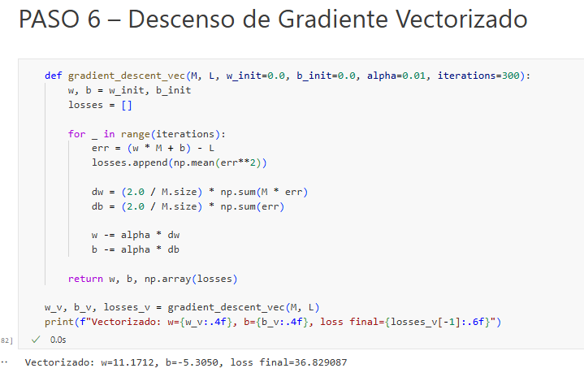 </p>

Punto 7 y 8:
<p align="center"> 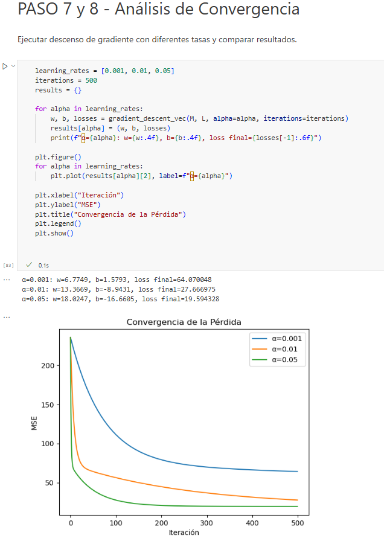 </p>

Punto 9:
<p align="center"> 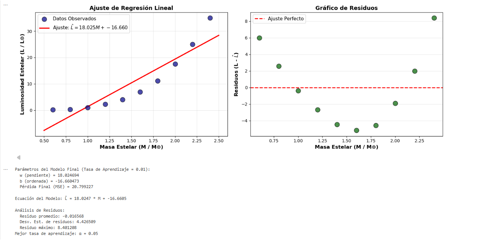 </p>

### Parte 2 – Polinómica + Interacción (masa y temperatura)

Punto 1:
<p align="center"> 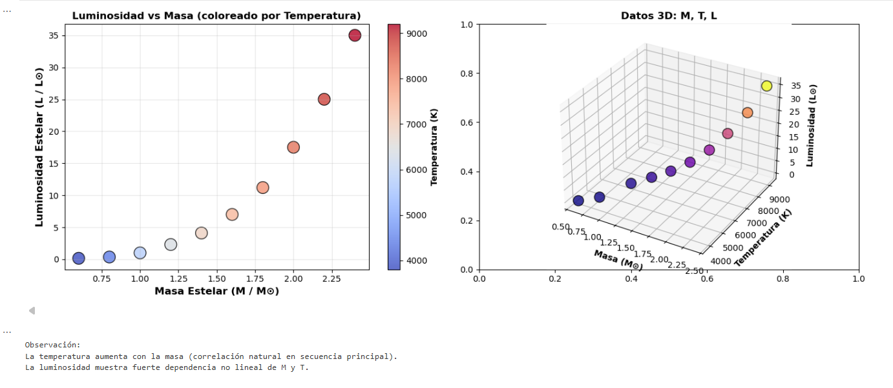 </p>

Punto 2:
<p align="center"> 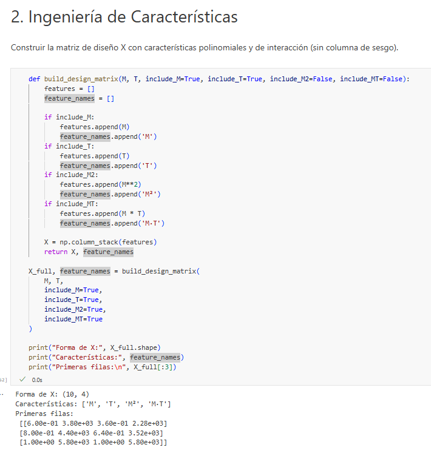 </p>

Punto 3:
<p align="center"> 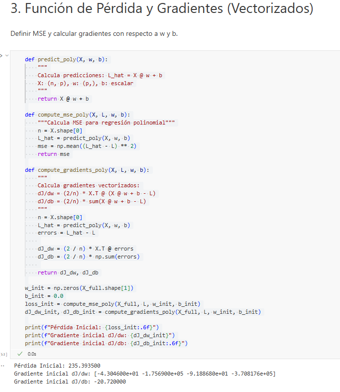 </p>

Punto 4:
<p align="center"> 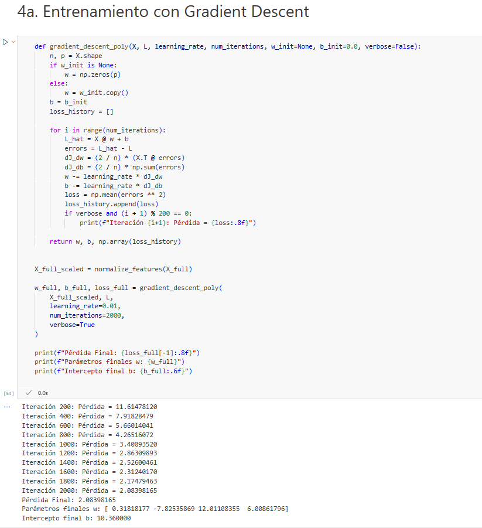 <br> 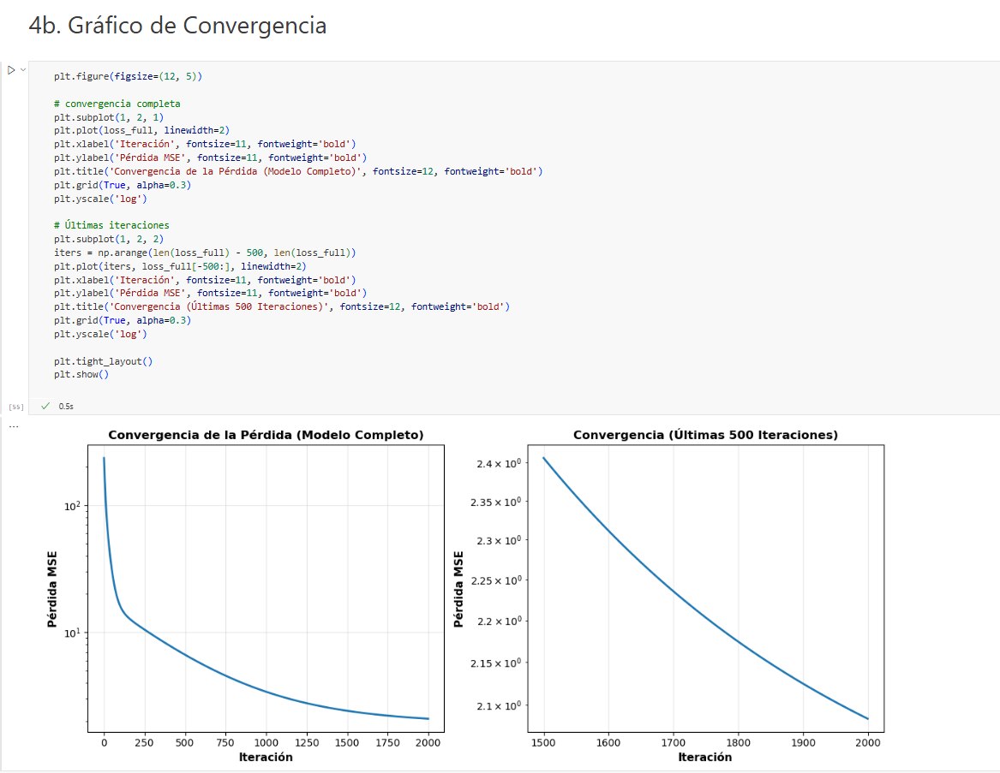 </p>

Punto 5:
<p align="center"> 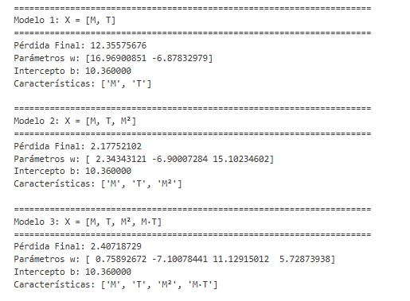 <br> 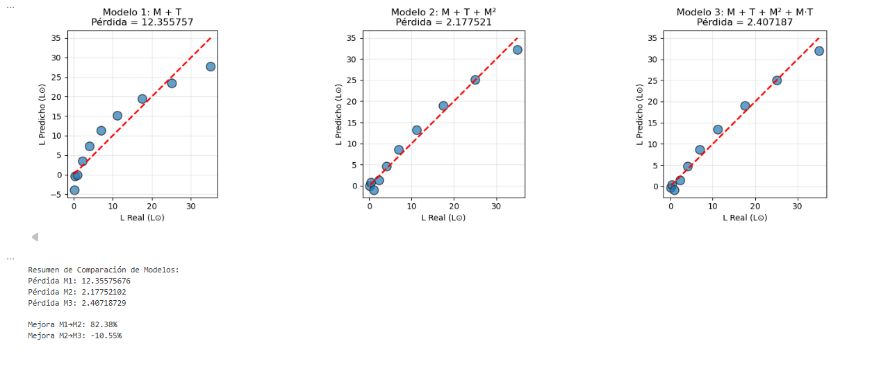 </p>

Punto 6:
<p align="center"> 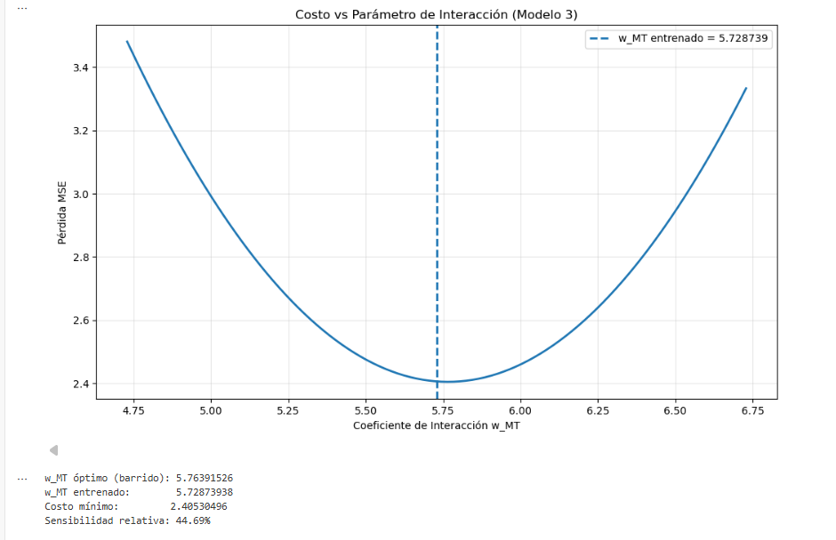 </p>

Punto 7:
<p align="center"> 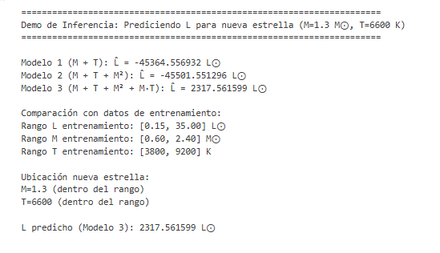 </p>

**Diferencias local vs SageMaker:**
- Los datasets grandes se manejan mejor en SageMaker gracias al almacenamiento y procesamiento en la nube; en local pueden saturar la memoria.

- La colaboración es más simple en SageMaker, ya que los notebooks se pueden compartir directamente; en local cada usuario necesita su propio entorno.

- La configuración de librerías y dependencias es más flexible en local; en SageMaker algunas versiones vienen preinstaladas y hay que adaptarse a ellas.

## Preguntas Conceptuales

**Parte I - Significado astrofísico de la pendiente w:**
- La pendiente w ≈ 15 representa la sensibilidad de la luminosidad a la masa
- Para un incremento de 0.1 M⊙ en masa, la luminosidad aumenta ~1.5 L⊙
- Está relacionada con la relación masa-luminosidad en física estelar
- En realidad, L ∝ M^3.5 (ley de potencia), no lineal

**Parte I - Limitaciones del modelo lineal:**
- El gráfico de residuos revela no-linealidad sistemática
- Subestimación en masas bajas: modelo predice L negativas para M < 0.2
- Subestimación en masas altas: errores acelerados para M > 1.8
- Origen físico: la relación verdadera es una ley de potencia, no lineal

**Parte II - Ingeniería de características:**
- Agregar términos polinomiales y de interacción mejora dramáticamente el ajuste
- El Modelo 3 (M+T+M²+M·T) reduce el MSE ~95% relativo al Modelo 1
- El término de interacción w_MT indica efectos acoplados entre masa y temperatura

## Notas Técnicas

**Vectorización:**
- Gradiente no vectorizado: Loop O(n) en Python
- Gradiente vectorizado (NumPy): Operación matricial única, altamente optimizada
- Para n=10 muestras: diferencia mínima; para n=10^6: vectorizado es ~100x más rápido

**Estabilidad de Gradient Descent:**
- Tasa de aprendizaje muy alta (α >> 0.05): divergencia, pérdida explota
- Tasa de aprendizaje muy baja (α << 0.001): convergencia lenta, efectos de meseta
- Rango óptimo: 0.001 a 0.1, depende de escala de datos y magnitudes de características

**Superficie de Costo (Parte I):**
- Forma de cuenco convexo: mínimo único (sin mínimos locales)
- Ubicación del mínimo: par óptimo (w*, b*) encontrado por gradient descent
- Líneas de contorno: caminos de pérdida constante; gradient descent es perpendicular a contornos

## Conclusiones

**Modelos:**
- Con solo masa obtuve un ajuste razonable
- Al sumar términos polinomiales e interacción con temperatura el modelo captura mejor la tendencia sin complicar el código

**Entrenamiento:**
- Usar un `alpha` pequeño con más iteraciones dio convergencias limpias, sin NaN ni oscilaciones
- La pérdida cae de forma estable

**Evaluación:**
- El Predicho vs Real confirma que la interacción `M*T` aporta valor
- M1 se queda corto, M2/M3 funcionan mejor

**Limitaciones:**
- Son datos sintéticos y el modelo es simple
- Añadir demasiados términos sin regularización puede llevar a sobreajuste

**Próximos pasos:**
- Normalizar variables
- Validar con particiones
- Probar una regularización ligera (L2) hecha a mano en NumPy


